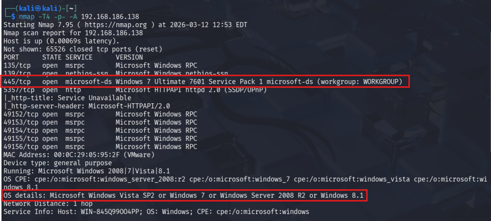
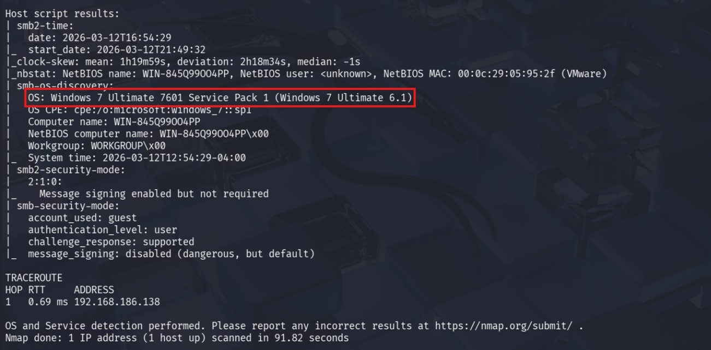
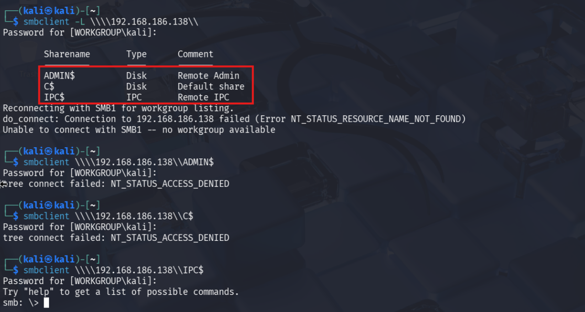
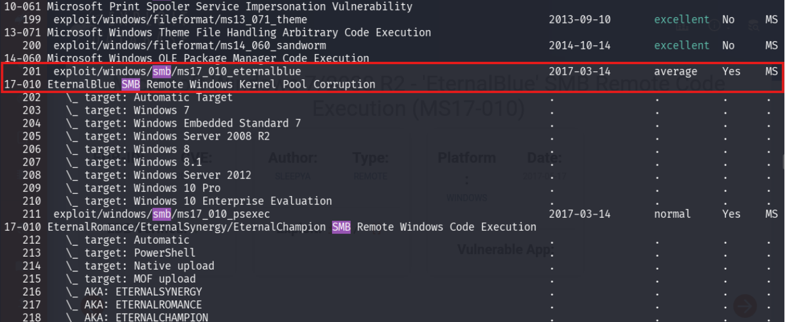
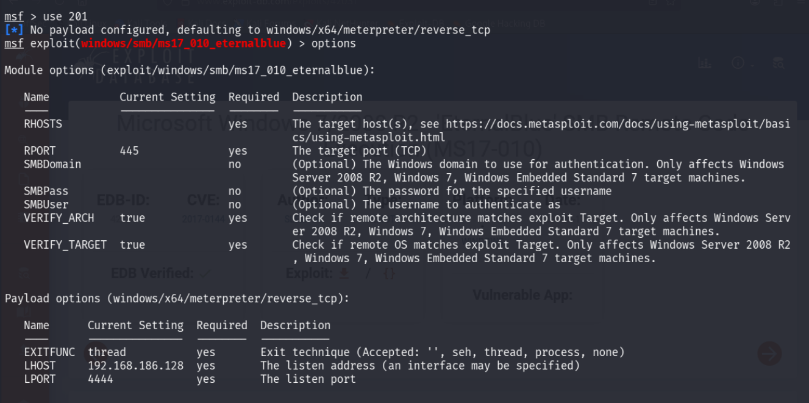
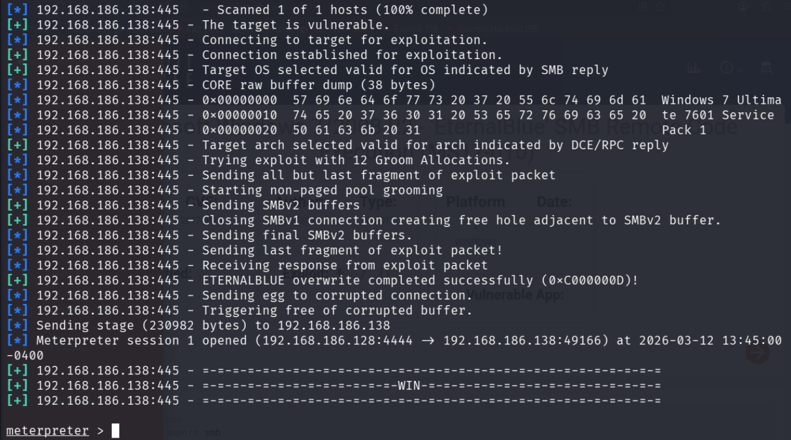
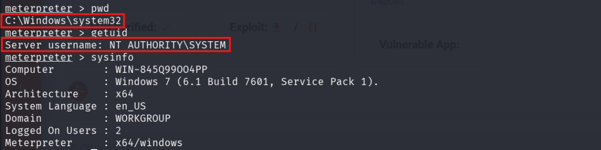
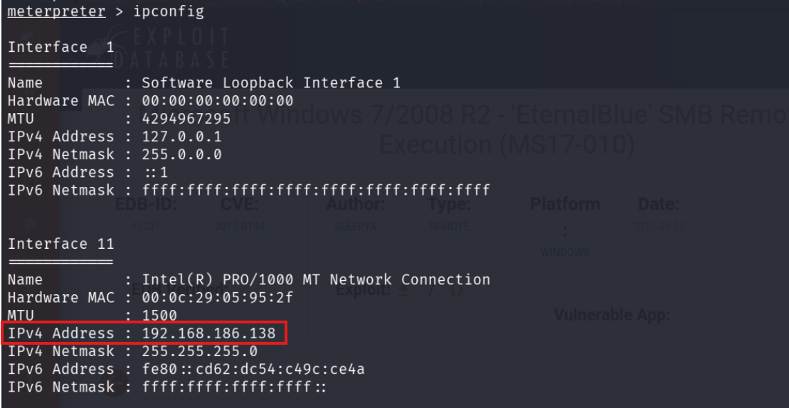

# Blue

## Disclaimer
This writeup was completed as part of TCM Security's Practical Junior Penetration Tester (PJPT) certification. It is not designed to be a walkthrough of the box, nor is it intended to substitute attempting to exploit the box yourself. This was my first ever attempt at exploiting a machine independently. Undoubtedly there are better ways of achieving the same outcome.

---

## Introduction
Blue is an open-source vulnerable machine exploited as part of the mid-course capstone for the TCM Security PJPT certification. My only objective was to successfully compromise the machine. The only assistance provided was the username and password to log in, run `ipconfig`, and obtain the IP address — in this case `192.168.186.138`.

---

## Enumeration
Using Nmap, I scanned the target to identify open ports and services.

The scans revealed that SMB port 445 was open, running Windows 7 Ultimate 7601 Service Pack 1. Researching this configuration identified a known exploit: **Microsoft Windows 7/2008 R2 - EternalBlue SMB Remote Code Execution (MS17-010)**.

I also ran SMBclient to gather additional information about the target.

While this revealed three shares, no further useful information was obtained.

---

## Exploitation
I opened Metasploit and searched for the EternalBlue exploit identified during enumeration.

I reviewed the available options and updated the `RHOSTS` setting to the target IP address.

I ran the exploit and gained access on the first attempt.

---

## Post-Exploitation
Following successful exploitation, I ran `pwd`, `getuid`, and `ipconfig` to confirm access and gather network information.

`getuid` confirmed I had achieved `NT AUTHORITY\SYSTEM` — the highest privilege level on a Windows machine, equivalent to root on Linux.

---

## Tools Used
- **OS:** Kali Linux 2025.4 running in VMware Pro
- **Nmap** — port scanning and service enumeration
- **SMBclient** — SMB share enumeration
- **Metasploit** — exploitation framework