# Dev

## Disclaimer

This writeup was completed as part of TCM Security's Practical Junior Penetration Tester (PJPT) certification. It is not designed to be a walkthrough of the box, nor is it intended to substitute attempting to exploit the box yourself. This writeup documents both my own attempt and the instructor's solution, as I was unable to complete this box independently. The Lessons Identified section reflects what I took away from the experience.

---

## Introduction
Dev is an open-source vulnerable machine exploited as part of the TCM Security PJPT certification. The objective was to successfully compromise the machine and achieve root access.

Initial access to the target machine was provided in order to retrieve the IP address using `ip a`, which in this case was `192.168.186.141`.

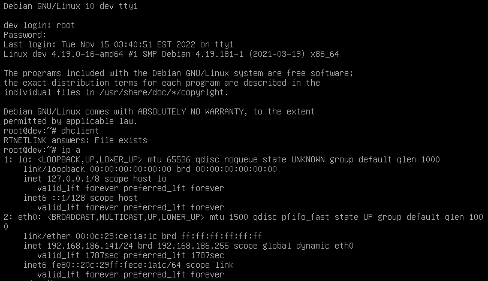

---

# My Approach
## Enumeration

I began by running an Nmap scan to identify open ports and services.

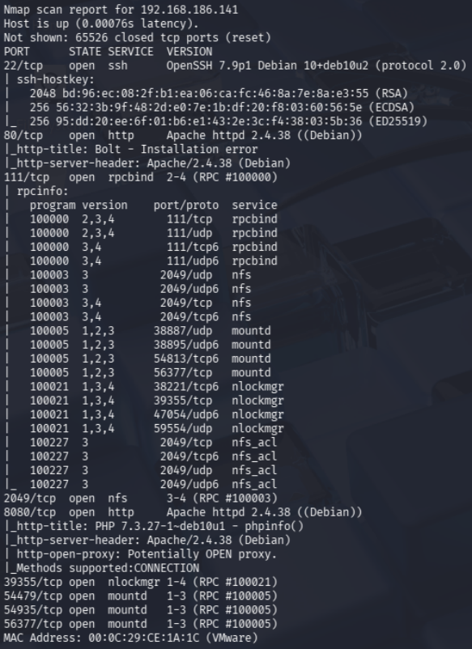

The scan revealed several open ports of interest:

1. Port 22 (SSH) — OpenSSH 7.9p1 Debian
2. Port 80 (HTTP) — Apache 2.4.38 (Debian)
3. Port 111 (RPCBind)
4. Port 2049 (NFS)
5. Port 8080 (HTTP) — Potential secondary web service
6. Additional high ports related to NFS (mountd, nlockmgr)

I navigated to the web server on port 80 and was presented with a Bolt CMS installation error page.

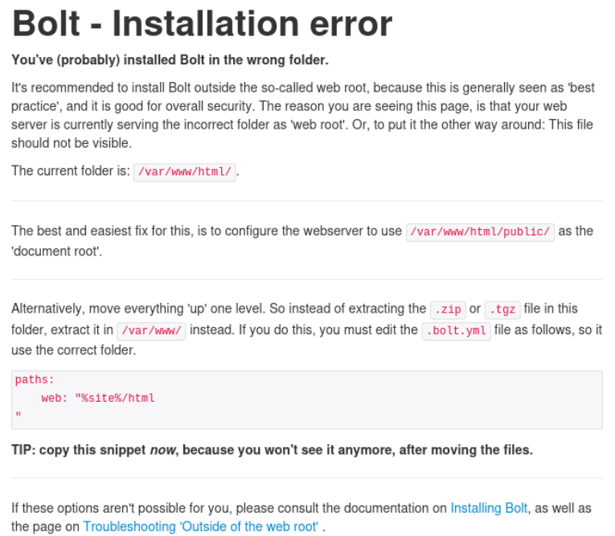

Viewing the page source revealed nothing of interest.

A Nikto scan confirmed the web server was running an outdated Apache version and indicated PHP was in use.

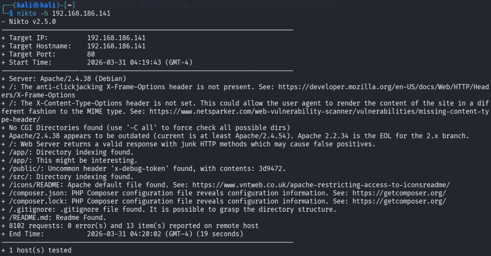

I then performed directory enumeration using Dirb.

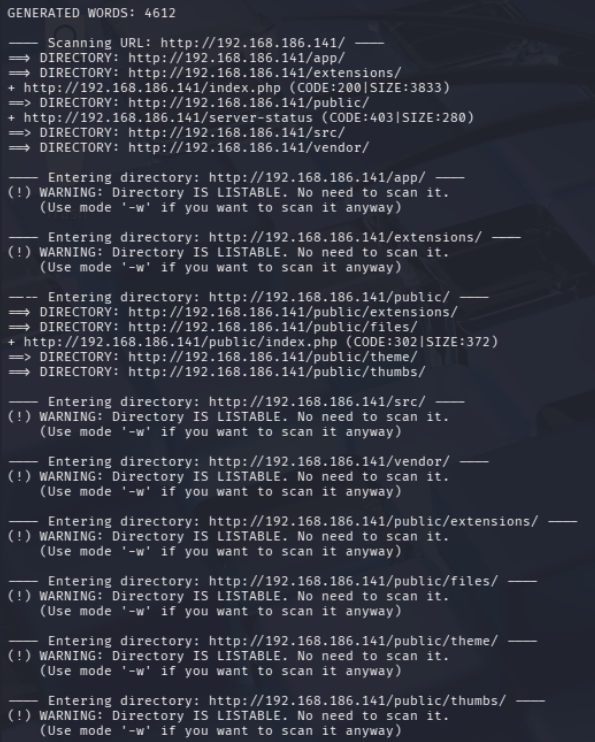

This revealed several directories, notably /app/, which exposed configuration-related content. Within this, I identified potential default credentials for SQLite:

- Username: bolt
- Password: I_love_java

---

## NFS Enumeration

Given that NFS was exposed, I proceeded to enumerate available shares.

Using `showmount -e 192.168.186.141`, I identified the /srv/nfs share and mounted it locally using `sudo mount -t nfs 192.168.186.141:/srv/nfs /tmp/nfsshare`.

Within the mounted directory, I discovered a file named `save.zip`. After extracting it, I found two files:

`id_rsa`
`todo.txt`

Both were password protected.

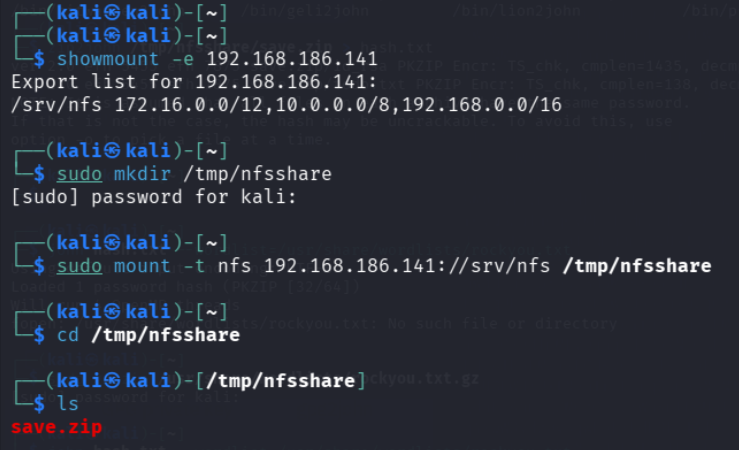

I used John the Ripper to crack the ZIP password using the following steps:

`zip2john save.zip > hash.txt`

`john hash.txt --wordlist=/usr/share/wordlists/rockyou.txt`

This revealed the password: `java101`

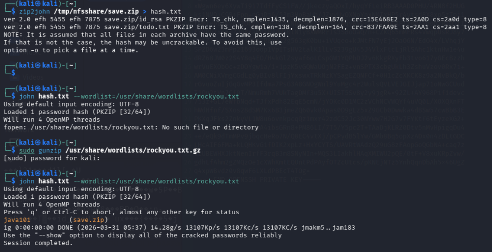

After extracting `save.zip`, I reviewed the contents: an SSH private key, `id_rsa` and a to-do list, `todo.txt`.

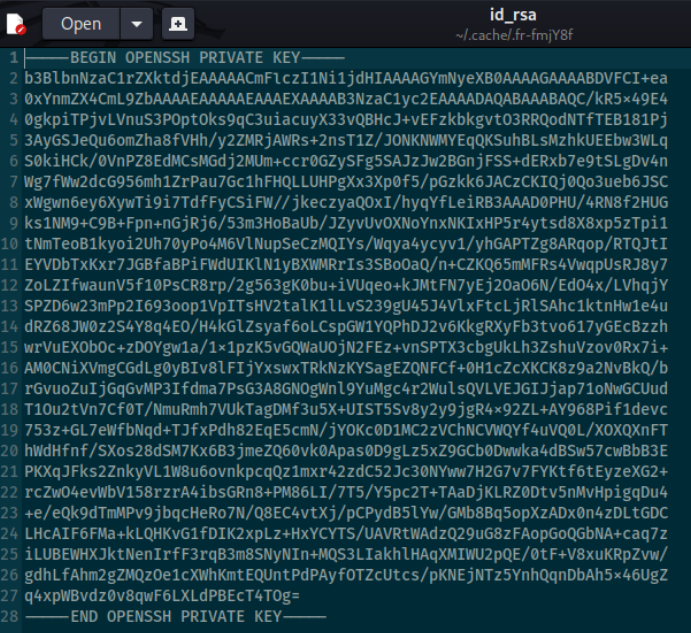
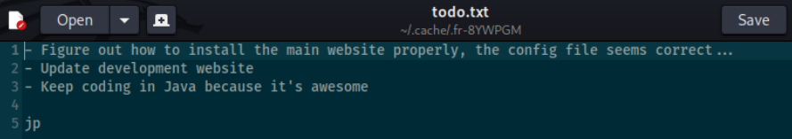

---

## Exploitation

I attempted to use the id_rsa key to authenticate via SSH, but the key prompted for a passphrase. I tested known passwords (`java101`, `I_love_java`) without success and was unable to proceed further via this path.

---

## Proxy Port 8080

It was at this point that I felt stuck as I had tried everything covered so far in the Practical Junior Penetration Tester course, so turned to the solution video. Early on in this video, the Instructor navigated to the website on Port 8080 by tying in `http://192.168.186.141:8080`. This is not something I had done before, so it opened up another avenue for me to follow. I paused the video at this point and continued with my enumeration.

I ran another Dirb scan, this time on port 8080, which revealed a `/dev/` directory, which provided me with a way to log into the website.

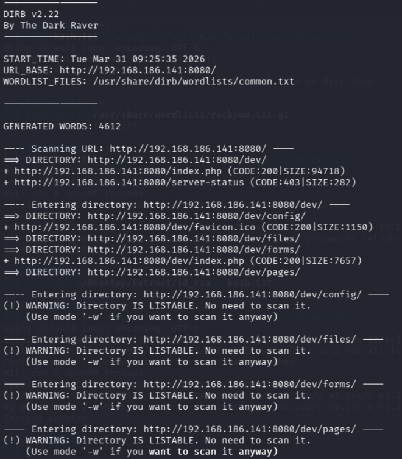

Navigating to `http://192.168.186.141:8080/dev/pages/`, I discovered multiple sets of credentials:

Username: `admin` / Password: `I_love_java`
Username: `guest` / Password: `java101`
Username: `thisisatest` / Password: `thisisatest`

I successfully logged in using the admin account.

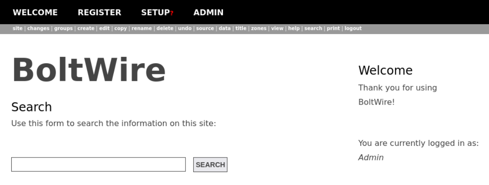

Within the application, I identified a file upload feature, indicating a potential attack vector. I also researched known vulnerabilities for BoltWire and identified:

1. BoltWire 3.4.16 - 'index.php' Multiple Cross-Site Scripting Vulnerabilities (2012)
2. BoltWire 6.03 - Local File Inclusion (2020)

However, I was unable to successfully leverage these vulnerabilities to gain further access and moved to the instructor solution.

---

# Instructor Solution
## Enumeration

The instructor followed a similar enumeration process, identifying key services:

Port 80 (HTTP)
Port 2049 (NFS)
Port 8080 (HTTP)

Both web services were enumerated using `ffuf`.

The NFS share was mounted in the same way:

`mount -t nfs 192.168.186.141:/srv/nfs /mnt/dev`

The save.zip file was identified as before.

Instead of `John the Ripper`, the instructor used `fcrackzip`:

`fcrackzip -v -u -D -p /usr/share/wordlists/rockyou.txt save.zip`

This also revealed the password: `java101`

---

## Exploitation

After initial enumeration of the web application, the instructor researched BoltWire vulnerabilities and focused on the Local File Inclusion (LFI) vulnerability. By exploiting LFI through the application, the instructor was able to browse the file system and locate user information.

A user named Jean-Paul was identified, which aligned with the initials “jp” found in the extracted files. Using this information, the instructor successfully authenticated via SSH:

Username: `jean-paul`
Password: `I_love_java`

This provided a foothold on the system.

---

## Post-Exploitation and Privilege Escalation

Once access was obtained, the instructor performed basic enumeration:

`history`
`sudo -l`

The `sudo -l` output revealed that the user could run zip with elevated privileges.

Using `GTFOBins`, the instructor identified a privilege escalation technique leveraging zip and executed it to gain root access.

After escalating privileges, the instructor navigated to `/root` and retrieved the root flag, completing the challenge.

---

# Lessons Identified
1. NFS shares are a high-value enumeration target and should always be investigated when exposed, as they often contain sensitive files.
2. There are multiple tools for password cracking (e.g., `John the Ripper` and `fcrackzip`), and understanding alternatives improves flexibility during engagements.
3. Not all discovered credentials are immediately useful — correlating findings (e.g., initials, usernames, and reused passwords) is critical.
4. Web applications running on non-standard ports (e.g., 8080) can host entirely separate attack surfaces and must not be overlooked.
5. Local File Inclusion (LFI) vulnerabilities can be used to traverse the filesystem and identify valid users, making them highly valuable for gaining initial access.
6. Enumerating for usernames is just as important as finding passwords — successful authentication often depends on correctly pairing both.
7. The `sudo -l` command is a critical step post-compromise, as it can quickly reveal privilege escalation paths.
8. `GTFOBins` is an essential resource for identifying privilege escalation techniques using allowed binaries.
9. My primary blocker was not knowing how to leverage the LFI vulnerability effectively — reinforcing the importance of understanding how vulnerabilities translate into practical exploitation steps.
10. Revisiting enumeration (especially additional ports and services) is crucial when progress stalls, as demonstrated by the importance of the 8080 web service in this box.

---

## Tools Used
- **Nmap** — port scanning and service enumeration
- **Nikto** — web server vulnerability scanning
- **Dirb / ffuf** — directory and content discovery
- **John the Ripper / fcrackzip** — password cracking
- **NFS tools** (showmount, mount) — share enumeration and access
- **GTFOBins** — privilege escalation techniques
- **SSH** — remote access to target system