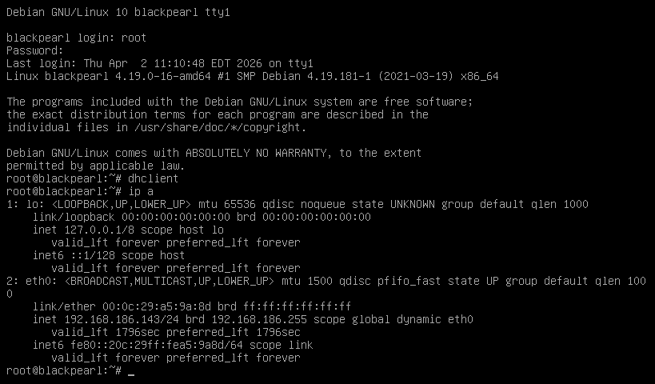
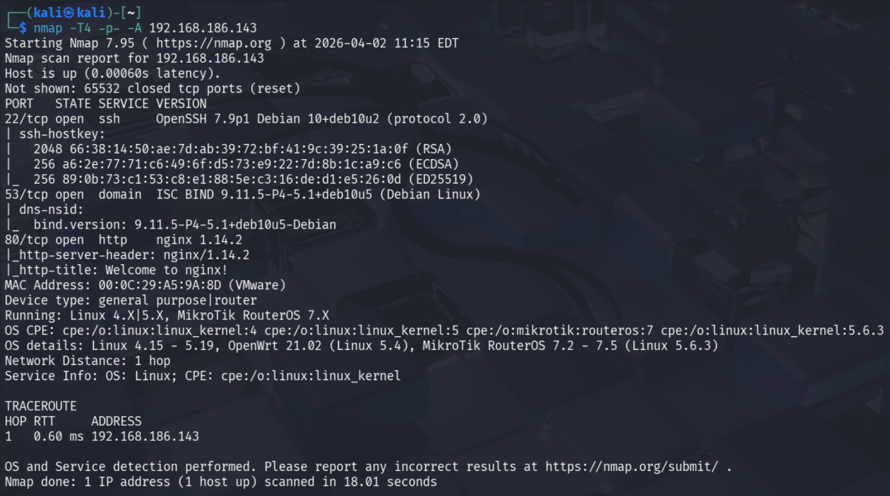
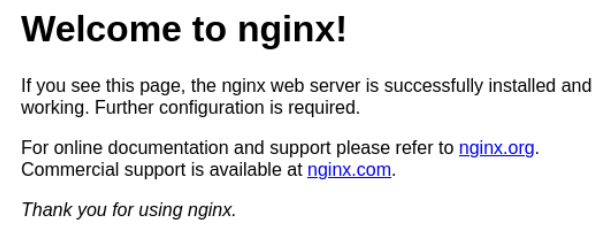
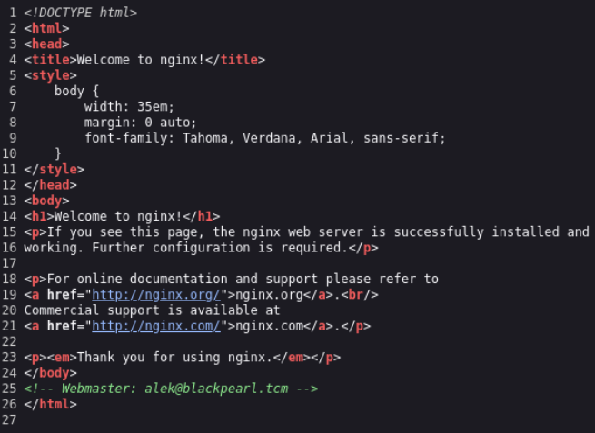
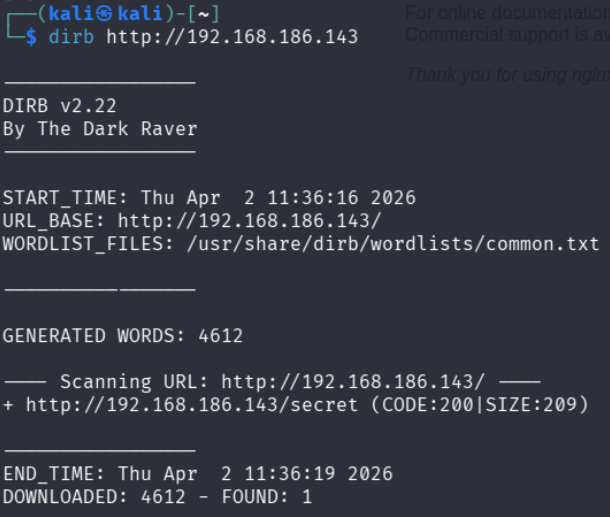
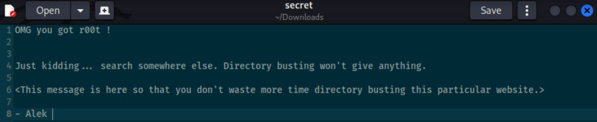

# Blackpearl

## Disclaimer
This writeup was completed as part of TCM Security's Practical Junior Penetration Tester (PJPT) certification. It is not designed to be a walkthrough of the box, nor is it intended to substitute attempting to exploit the box yourself. This writeup documents my own attempt, the point at which I deferred to the instructor solution, and the steps taken from that point to achieve root. The Lessons Identified section reflects what I took away from the experience.

---

## Introduction
Blackpearl is an open-source vulnerable machine exploited as part of the mid-course capstone for the TCM Security PJPT certification. My objective was to successfully compromise the machine and achieve root access. The only assistance provided was the username and password to log into the target machine directly, run `ip a`, and obtain the IP address — in this case `192.168.186.143`.

---

## Enumeration

Using Nmap, I scanned the target to identify open ports and services.

The scan revealed three open ports:

1. Port 22 (SSH) — OpenSSH 7.9p1
2. Port 53 (DNS) — ISC BIND 9.11.5-P4-5.1+deb10u5 (Debian Linux)
3. Port 80 (HTTP) — nginx 1.14.2

I navigated to the web server, which displayed the default nginx welcome page.

Viewing the page source revealed an email address for the webmaster: `alek@blackpearl.tcm`.

I ran a Dirb scan against the target, which returned a single result: `/secret`.

Navigating to that URL automatically downloaded a file, the contents of which made clear that directory busting would not yield any further useful results.

At this point, the only remaining service to enumerate was DNS. As DNS enumeration had not been covered in the course up to this point, I deferred to the instructor video from here.

---

# Instructor Solution
## DNS Enumeration and Initial Access 

The instructor used `dnsrecon` to perform a reverse lookup against the target, specifying the loopback range and the target machine as the nameserver. The `-d` flag is required by the tool syntax even when the domain name is not meaningful to the query:

`dnsrecon -r 127.0.0.0/24 -n 192.168.186.143 -d blah`

This returned a PTR record resolving `127.0.0.1` to `blackpearl.tcm`, confirming the domain name associated with the target.

The hosts file on the attacker machine was updated to map the target IP to this domain: `sudo nano /etc/hosts`, adding: `192.168.186.143 blackpearl.tcm`

With the hosts file updated, navigating to `http://blackpearl.tcm` in the browser — rather than the IP address directly — revealed a PHP info page in place of the default nginx welcome page, disclosing system information including the OS, hostname, and system architecture.

Another Directory Busting scan was run, using `ffuf`, this time targeting the domain rather than the IP address:

`ffuf -w /usr/share/wordlists/dirbuster/directory-list-2.3-medium.txt:FUZZ -u http://blackpearl.tcm/FUZZ`

This revealed a `/navigate` directory, which hosted a login page for **Navigate CMS**. A search for Navigate CMS vulnerabilities identified a Remote Code Execution (RCE) exploit available in Metasploit.

---

## Exploitation

The Metasploit module was loaded directly using its path, with the following options configured:

- `RHOSTS` set to the target IP address
- `VHOST` set to `blackpearl.tcm`

Running the exploit established a Meterpreter session. Typing `shell` dropped into an interactive shell, and `whoami` confirmed the session was running as `www-data` — a low-privileged web server user, indicating that privilege escalation would be required.

---

## Post-Exploitation and Privilege Escalation

To make the shell more functional, a TTY shell was spawned using Python. The presence of Python on the target was first confirmed:

`which python`

This returned `/usr/bin/python`, confirming it was available. A TTY shell was then spawned using a standard Python one-liner sourced from a spawning TTY shells reference:

`python -c 'import pty; pty.spawn("/bin/bash")'`

LinPEAS was transferred to the target using a Python HTTP server on the attacker machine and `wget` on the target, placed in the `/transfer` directory. It was made executable and run using:

`chmod +x linpeas.sh`
`./linpeas.sh`

LinPEAS identified an unknown **SUID binary**. As this was new to me, the instructor explained that a **SUID** (Set User ID) is a special file permission — represented as `rws` rather than `rwx` — that causes a binary to execute with the privileges of its owner rather than the user running it. Since the binary was owned by root, executing it would grant root-level access.

The binary was identified as **PHP 7.3**, located at `/usr/bin/php7.3`. As in one of the previous boxes, the instructor checked GTFOBins, filtering by SUID, and the corresponding PHP entry provided a one-liner for privilege escalation:

`/usr/bin/php7.3 -r "pcntl_exec('/bin/sh', ['-p']);"`

Executing this command returned a root shell, completing the privilege escalation and fully compromising the machine.

---

# Lessons Identified

1. The default nginx welcome page does not indicate there is nothing further to find on the web server. Virtual host routing means that navigating to a domain name rather than the IP address directly can reveal entirely different web content hosted on the same machine.
2. DNS is a high-value enumeration target when exposed. A reverse lookup using `dnsrecon` can reveal domain names associated with the target that are not otherwise visible, unlocking additional attack surface.
3. The `-d` flag in `dnsrecon` is required by the tool even when the domain value is not meaningful to the query being performed.
4. Adding entries to `/etc/hosts` is a simple but critical technique for resolving domain names in an isolated lab environment where no DNS server is available to the attacker machine. Editing the hosts file requires elevated privileges (`sudo`).
5. Running directory enumeration against a domain name rather than an IP address can return different results, as virtual host configuration may serve different content depending on how the request is made.
6. Known CMS platforms should always be researched for public exploits once identified. Navigate CMS had a documented RCE exploit available in Metasploit, making exploitation straightforward once the application was discovered.
7. The VHOST option in Metasploit modules is important when a target serves different content based on the requested hostname. Setting it incorrectly can cause an exploit to fail even when all other options are correct.
8. Spawning a TTY shell using Python (`python -c 'import pty; pty.spawn("/bin/bash")'`) is an important post-exploitation step, as many privilege escalation techniques and interactive tools require a proper TTY to function correctly.
9. SUID binaries are a significant privilege escalation vector on Linux systems. When a binary with the SUID bit set is owned by root, it executes as root regardless of who runs it. LinPEAS flags unknown SUID binaries as high-priority findings.
10. GTFOBins is an essential reference for identifying how legitimate binaries — including those with the SUID bit set — can be abused for privilege escalation. Filtering by SUID quickly narrows down applicable techniques.
11. DNS enumeration was not covered in the course prior to this capstone box, making independent exploitation of this machine impractical at this stage of the course. This reinforced the view that these boxes function as learning exercises rather than true independent assessments — and the writeup format used throughout this capstone reflects that honestly.

---

## Tools Used
- **Nmap** — port scanning and service enumeration
- **Dirb / ffuf** — web directory enumeration
- **dnsrecon** — DNS enumeration and reverse lookup
- **Metasploit** — exploitation via Navigate CMS RCE module
- **LinPEAS** — Linux privilege escalation enumeration
- **GTFOBins** — SUID binary privilege escalation reference
- **Python HTTP Server** — file transfer via temporary web server
- **Python TTY spawn** — interactive shell upgrade
